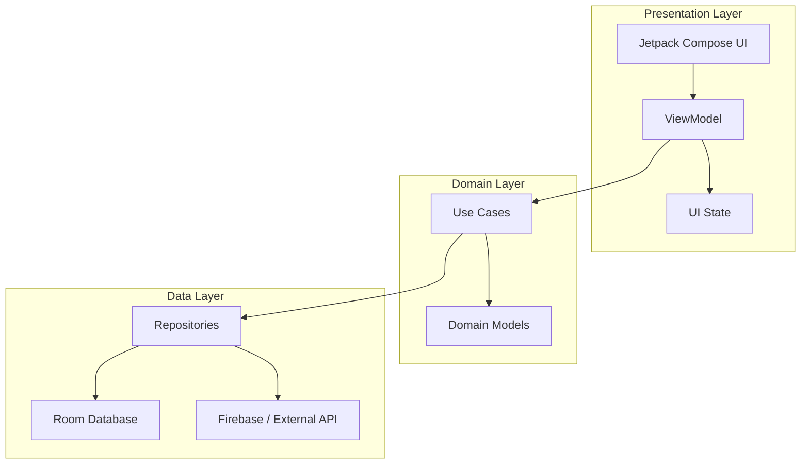

# 🏗️ Shishu-Sneh Architecture

This document describes the architectural patterns and design decisions implemented in the **Shishu-Sneh** application.

## 📐 Architecture Overview
The application follows **Clean Architecture** principles combined with **MVVM (Model-View-ViewModel)** to ensure high maintainability, testability, and scalability.

## 📂 Layer Responsibilities

### 1. Presentation Layer (`presentation/`)
- **Jetpack Compose**: 100% declarative UI components using Material 3 design tokens.
- **ViewModels**: Manage state using `StateFlow` and handle side effects. Interacts exclusively with Domain Use Cases.
- **Navigation**: Type-safe navigation implementation via a centralized `SetupNavGraph`.

### 2. Domain Layer (`domain/`)
- **Use Cases**: Encapsulates single-responsibility business logic (e.g., `GetVaccinesUseCase`, `GetGrowthChartUseCase`).
- **Repositories (Interfaces)**: Decouples the domain logic from specific data implementations (Room vs. Firebase).
- **Models**: Immutable Kotlin data classes representing core business entities.

### 3. Data Layer (`data/`)
- **Room Database + SQLCipher**: Local storage providing **AES-256 encryption** for all health records, ensuring PII (Personally Identifiable Information) security.
- **Firebase Realtime Sync**: Uses Firestore for cross-device record synchronization and Cloud Messaging (FCM) for low-latency notifications.
- **Generative AI Integration**: Interfaces with the **Google Gemini Pro API** via the Generative AI SDK, providing context-aware health insights.
- **Worker Management**: Uses `WorkManager` for persistent, guaranteed background processing of vaccination reminders.

## 🛠️ Security & Scaling
- **Dependency Injection**: Hilt is used for managing component lifecycles and facilitating unit testing.
- **Reactive Streams**: Kotlin Coroutines and Flows ensure a fluid, non-blocking UI experience even during complex AI processing or database encryption.
- **Health Data Privacy**: By combining local encryption (SQLCipher) with secure Firebase Auth, the app meets high standards for medical data privacy.

## 🔄 Data Flow
1. User interacts with the **Compose UI**.
2. **ViewModel** triggers a **UseCase**.
3. **UseCase** requests data from the **Repository**.
4. **Repository** fetches from **Room (Local)** or **Firebase (Remote)**.
5. Data flows back via **Flows/State** to the UI, ensuring a reactive user experience.
